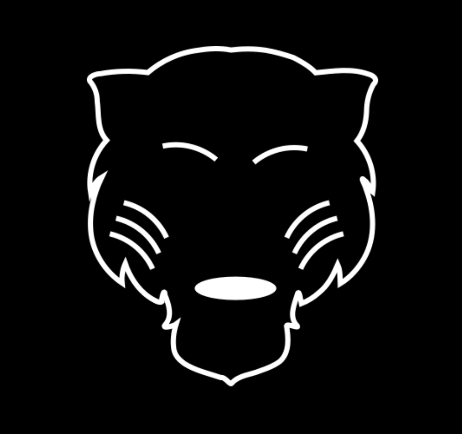

[![LinkedIn][linkedin-shield]][linkedin-url]

<!-- PROJECT LOGO -->
 

    

  <h3 align="center">Wellness Chatbot Server</h3>

## About The Project

Take a look at my wellness app's [readme](https://github.com/mister36/wellness-app) to understand the context of this project.

This is where all of the magic happens. The actual wellness assistant is built off of [Rasa's](https://github.com/RasaHQ/rasa) machine learning framework. Using Rasa, Moti has the ability to save user information into it's "memory" and start complex conversations that improves mental wellbeing. Moti connects with the [Node.JS server](https://github.com/mister36/wellness-api) through a custom WebSocket connection, enabling lightning-fast communication.

### Built With

* [Rasa](https://rasa.com/)

<!-- CONTACT -->
## Contact

Adam Achebe -  achebeadam@gmail.com

Project Link: [https://github.com/mister36/wellness-chatbot](https://github.com/mister36/wellness-chatbot)

<!-- MARKDOWN LINKS & IMAGES -->
<!-- https://www.markdownguide.org/basic-syntax/#reference-style-links -->
[contributors-shield]: https://img.shields.io/github/contributors/othneildrew/Best-README-Template.svg?style=for-the-badge
[contributors-url]: https://github.com/othneildrew/Best-README-Template/graphs/contributors
[forks-shield]: https://img.shields.io/github/forks/othneildrew/Best-README-Template.svg?style=for-the-badge
[forks-url]: https://github.com/othneildrew/Best-README-Template/network/members
[stars-shield]: https://img.shields.io/github/stars/othneildrew/Best-README-Template.svg?style=for-the-badge
[stars-url]: https://github.com/othneildrew/Best-README-Template/stargazers
[issues-shield]: https://img.shields.io/github/issues/othneildrew/Best-README-Template.svg?style=for-the-badge
[issues-url]: https://github.com/othneildrew/Best-README-Template/issues
[license-shield]: https://img.shields.io/github/license/othneildrew/Best-README-Template.svg?style=for-the-badge
[license-url]: https://github.com/othneildrew/Best-README-Template/blob/master/LICENSE.txt
[linkedin-shield]: https://img.shields.io/badge/-LinkedIn-black.svg?style=for-the-badge&logo=linkedin&colorB=555
[linkedin-url]: https://www.linkedin.com/in/adam-achebe/
[product-screenshot]: images/screenshot.png
